# LiuXingDaily
一个 **免费、开源、无广告** 的 Material 3 风格本地日记应用

作为一个开源项目，如果它对你有所帮助可以给 star 支持。你的支持对我非常重要！

## 截图
<div>
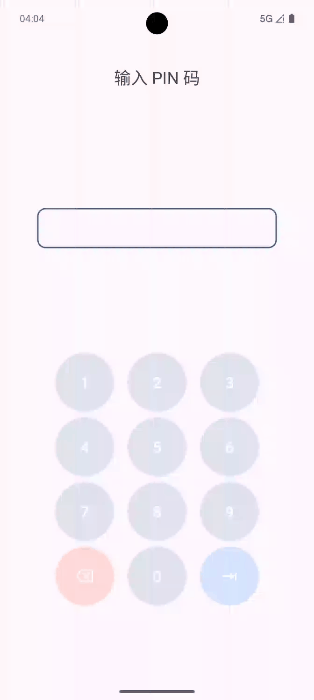
 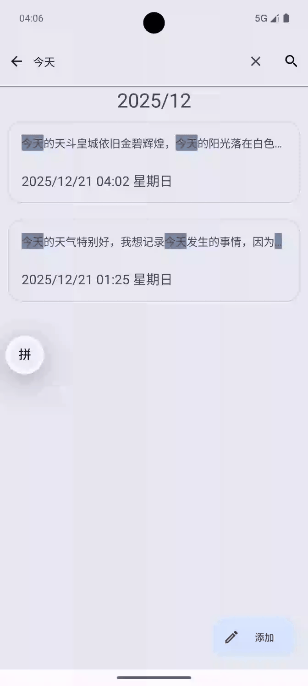
</div>

<div>
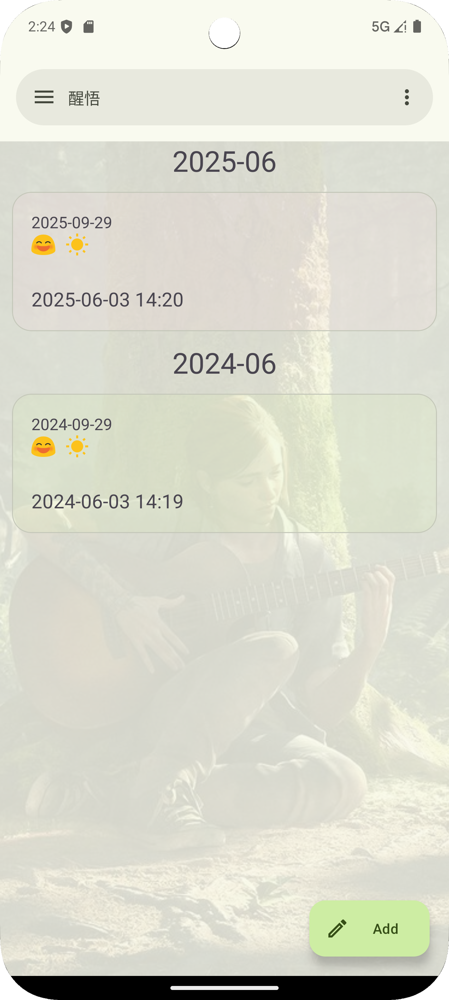
 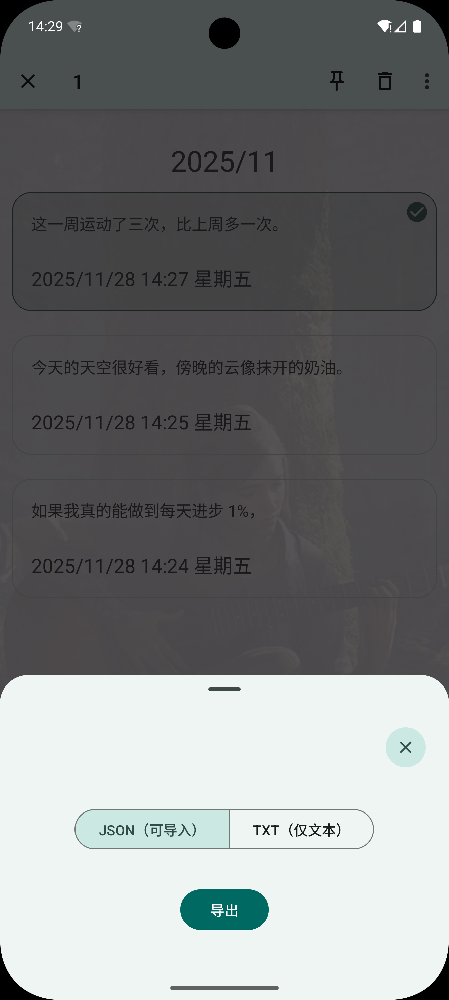
 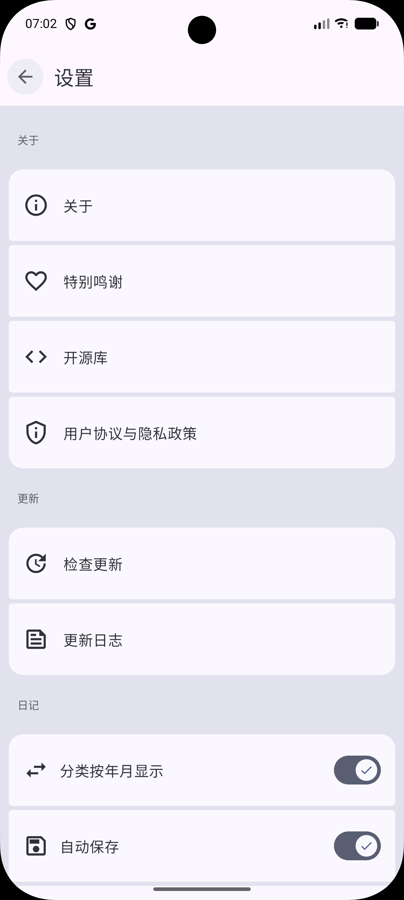
</div>

<div>
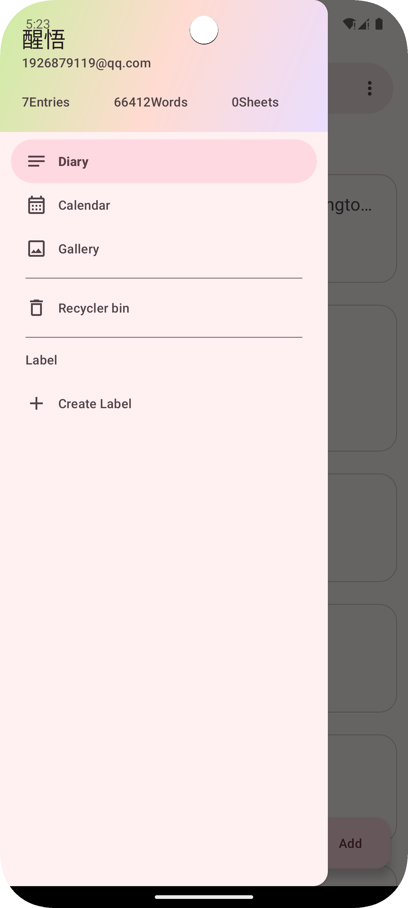
 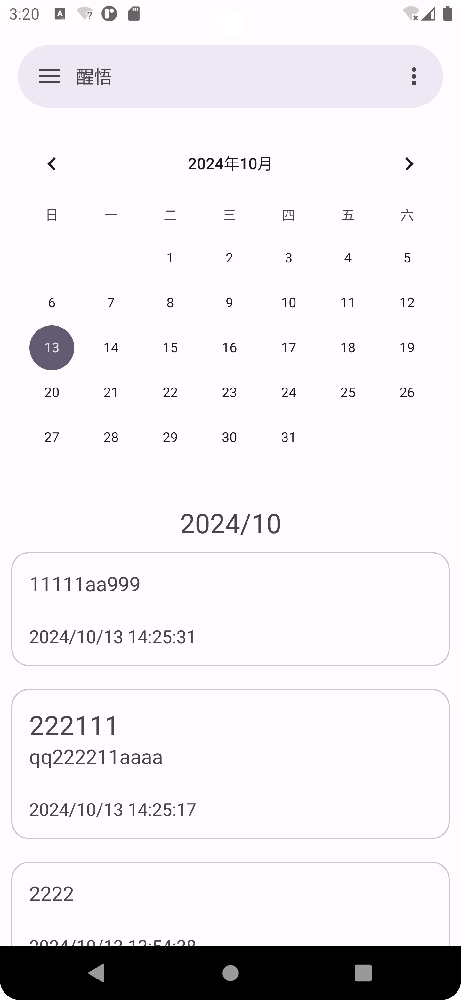
 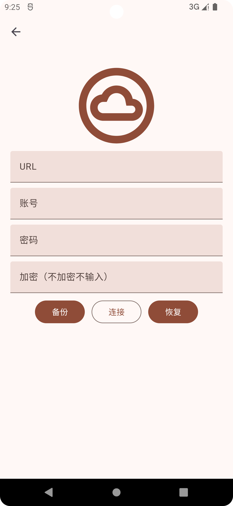
</div>

<div>

 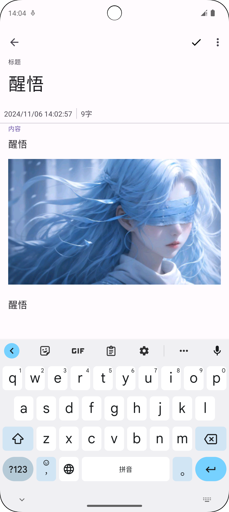
 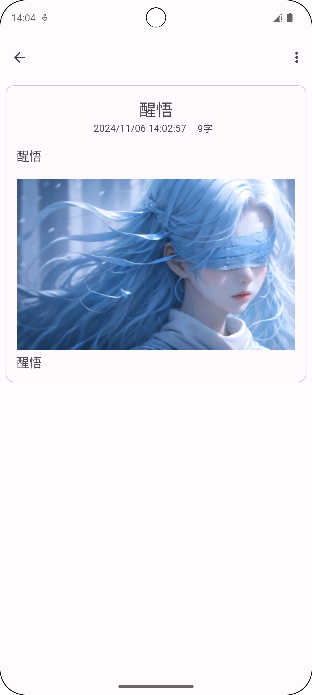
</div>

<div>
 
 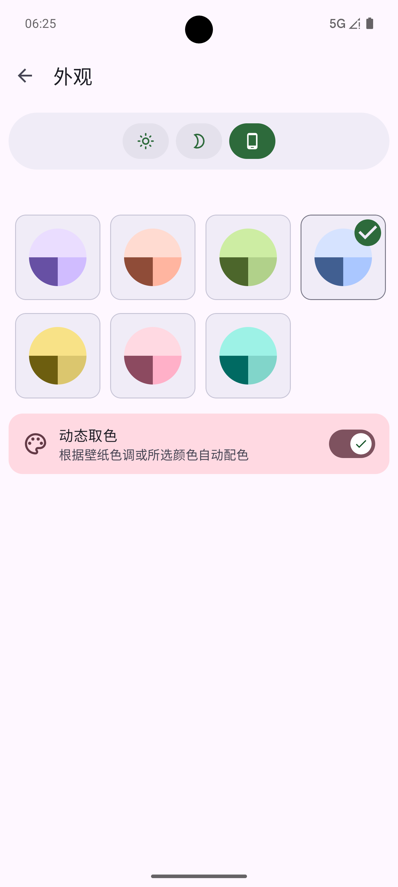
 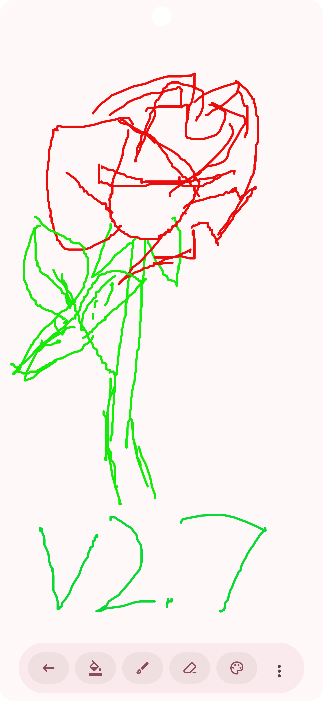
</div>

## 特色
- 日记记录、编辑、查看和搜索
- 支持图片、视频和音频的多媒体日记
- WebDav 备份与恢复
- 支持外观自定义
- 遵循 Material 3 设计
- 免费、开源、无广告

## License
```
 Copyright [2024] [LiuXing]

   Licensed under the Apache License, Version 2.0 (the "License");
   you may not use this file except in compliance with the License.
   You may obtain a copy of the License at

       http://www.apache.org/licenses/LICENSE-2.0

   Unless required by applicable law or agreed to in writing, software
   distributed under the License is distributed on an "AS IS" BASIS,
   WITHOUT WARRANTIES OR CONDITIONS OF ANY KIND, either express or implied.
   See the License for the specific language governing permissions and
   limitations under the License.
```
